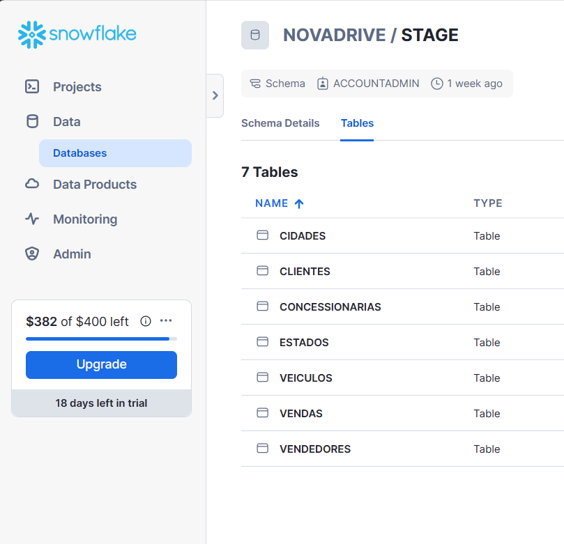
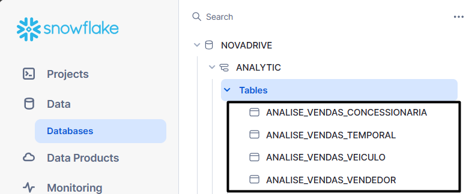
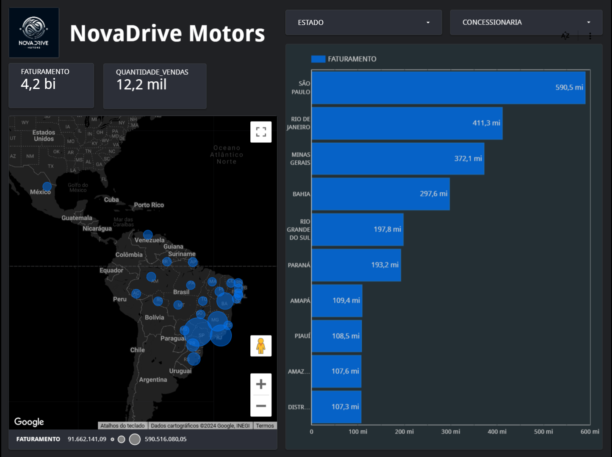

# Data Warehouse Project in Snowflake

This repository contains an end-to-end ELT project for the fictitious dealership **NovaDrive Motors**. Raw data is extracted from **PostgreSQL**, loaded into the **Snowflake** staging layer through **Apache Airflow**, transformed with **dbt**, and exposed for business reporting in **Looker Studio**.


## Architecture

The pipeline is organized in three main layers:

1. **Ingestion**
   Raw tables are pulled from PostgreSQL and loaded into Snowflake stage tables through an Airflow DAG.
2. **Transformation**
   dbt standardizes the source data, builds dimensions and facts, and creates analytical marts for dashboard consumption.
3. **Analytics**
   The final star-schema models and aggregated views support sales analysis by dealership, seller, vehicle, and month.

## Repository Structure

```text
dag_airflow/
  dag_extract_and_load_data_postgresql_to_snowflake.py
dbt/
  dbt_project.yml
  models/
    stage/
    dimensions/
    facts/
    analysis/
img/
README.md
```

## Airflow Ingestion Layer

The Airflow DAG in `dag_airflow/dag_extract_and_load_data_postgresql_to_snowflake.py` now reflects the current project state:

- Uses `PostgresHook` and `SnowflakeHook` instead of hard-coded credentials.
- Reads connection names from environment variables:
  - `NOVADRIVE_POSTGRES_CONN_ID` default: `postgres_default`
  - `NOVADRIVE_SNOWFLAKE_CONN_ID` default: `snowflake`
  - `NOVADRIVE_POSTGRES_SCHEMA` default: `public`
- Loads these source tables:
  - `veiculos`
  - `estados`
  - `concessionarias`
  - `vendedores`
  - `clientes`
  - `vendas`
  - `cidades`
- Supports incremental ingestion using both:
  - the highest primary key already loaded
  - the latest `data_atualizacao` or `data_inclusao` watermark
- Replaces changed rows in Snowflake before reinserting refreshed records, so updates are not missed.

This is a daily DAG scheduled with `@daily`.

## dbt Transformation Layer

The dbt project is configured in `dbt/dbt_project.yml` under the package name `novadrive_dwh`.

### Stage Models

The stage layer cleans and standardizes raw source data from `NOVADRIVE.STAGE`, including:

- text normalization with `INITCAP`, `TRIM`, and `UPPER`
- numeric casting for sales and vehicle values
- fallback handling for `data_atualizacao`

### Dimensional Models

The dimensional layer creates:

- `dim_cidades`
- `dim_clientes`
- `dim_concessionarias`
- `dim_estados`
- `dim_veiculos`
- `dim_vendedores`

### Fact Model

The fact layer creates:

- `fct_vendas`

`fct_vendas` is configured as an incremental model with merge semantics and schema-sync behavior so inserts and updates can be handled more safely than a simple `MAX(id)` pattern.

### Analytical Models

The analytical layer creates the following marts for reporting:

- `analise_vendas_concessionaria`
- `analise_vendas_temporal`
- `analise_vendas_veiculo`
- `analise_vendas_vendedor`


## Data Quality

The file `dbt/models/schema.yml` contains model tests for:

- primary key uniqueness
- not-null constraints
- key relationships between dimensions and fact tables

This gives the project a basic validation layer for the star schema.

## Source Configuration

The dbt source is defined in `dbt/models/source.yml` and points to:

- database: `NOVADRIVE`
- schema: `STAGE`

Expected staged source tables:

- `cidades`
- `clientes`
- `estados`
- `concessionarias`
- `veiculos`
- `vendedores`
- `vendas`

## Dashboard Use Case

The transformed data supports a BI dashboard for NovaDrive Motors sales analysis, including:

- sales by dealership
- sales by seller
- sales by vehicle
- monthly sales trends
- regional performance by city and state

The final dashboard was designed in Looker Studio for business users and leadership reporting.

## Local Setup

### Airflow

You need Airflow with the PostgreSQL and Snowflake providers available. Configure the required Airflow connections before running the DAG:

- `postgres_default` or the value of `NOVADRIVE_POSTGRES_CONN_ID`
- `snowflake` or the value of `NOVADRIVE_SNOWFLAKE_CONN_ID`

### dbt

You need a dbt profile named `default` that points to Snowflake.

Typical commands:

```bash
cd dbt
dbt debug
dbt build
```

## Notes

- The repository was cleaned up to remove starter dbt example models.
- The DAG no longer stores plaintext source credentials in code.
- The incremental ingestion and fact-model logic were updated so changed records are handled more reliably.
- Basic dbt tests were added, but runtime validation still depends on a working local dbt and Airflow environment.

## Project Images






